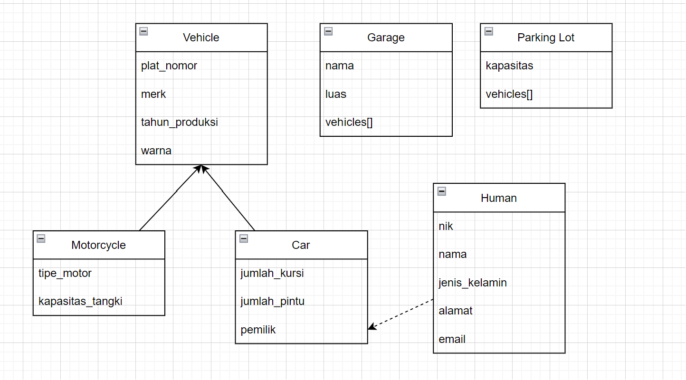

# LP2DPBO2024C1

Saya Muhamad Sabil Fausta NIM 2210142 mengerjakan Latihan 3 dalam mata kuliah Desain dan Pemrograman Berorientasi Objek untuk keberkahanNya maka saya tidak melakukan kecurangan seperti yang telah dispesifikasikan. Aamiin.

# Desain Kelas Program

### Kelas Human

nik : Menyimpan identifikasi unik untuk setiap individu. Tipe data yang digunakan adalah String karena NIK biasanya merupakan kombinasi angka yang tetap dan panjangnya konsisten, yang di Indonesia terdiri dari 16 karakter.

nama: Menyimpan nama individu. Tipe data String dipilih karena nama adalah urutan karakter.

jenis_kelamin: Menyimpan informasi jenis kelamin individu. Tipe data String digunakan karena jenis kelamin diwakili dalam bentuk teks, seperti "Laki-laki" atau "Perempuan".

alamat: Menyimpan alamat individu. String digunakan karena alamat diwakili sebagai urutan karakter dan kalimat.

email: Menyimpan alamat email individu. Tipe data String dipilih karena email merupakan urutan karakter yang mengikuti format spesifik.

### Kelas Car (extends Vehicle)

jumlah_kursi: Menyimpan informasi tentang jumlah kursi dalam mobil. Tipe data integer dipilih karena jumlah kursi diwakili dalam bentuk angka bulat.

jumlah_pintu: Menyimpan informasi tentang jumlah pintu dalam mobil. Tipe data integer digunakan karena jumlah pintu diwakili dalam bentuk angka bulat.

### Kelas Motorcycle (extends Vehicle)

tipe_motor: Menyimpan informasi tentang tipe motor. Tipe data String digunakan karena tipe motor sering kali diwakili dalam kombinasi angka dan huruf atau hanya teks.

kapasitas_tangki: Menyimpan informasi tentang kapasitas tangki bahan bakar motor dalam liter. Tipe data double dipilih karena kapasitas tangki bisa memiliki komponen desimal.

### Kelas Garage

nama: Menyimpan nama dari garasi. Tipe data String digunakan karena nama garasi diwakili sebagai urutan karakter.

luas: Menyimpan informasi tentang luas garasi dalam meter persegi. Tipe data double dipilih karena luas garasi bisa memiliki komponen desimal untuk presisi.

\_vehicles: Menyimpan daftar kendaraan yang diparkir dalam garasi. Digunakan array of object karena garasi bisa menyimpan banyak kendaraan.

### Kelas ParkingLot

kapasitas: Menyimpan informasi tentang kapasitas maksimal kendaraan yang bisa diparkir di tempat parkir. Tipe data integer dipilih karena kapasitas diwakili dalam bentuk angka bulat.

\_vehicles: Menyimpan daftar kendaraan yang diparkir dalam garasi. Digunakan array of object karena garasi bisa menyimpan banyak kendaraan.

# Alur Program

Dalam program ini, saya mulai dengan mendeklarasikan dua tempat penyimpanan kendaraan: sebuah Garage bernama garasiKopma dengan kapasitas 200 kendaraan, dan sebuah ParkingLot dengan kapasitas 100 kendaraan.

Kemudian, saya membuat tiga objek Human yang masing-masing mewakili pemilik kendaraan, dengan informasi unik seperti NIK, nama, jenis kelamin, alamat, dan email.

Selanjutnya, saya menginisialisasi dua vector, satu untuk menyimpan pointer ke objek Car dan satu lagi untuk objek Motorcycle. Saya membuat enam objek Car dan dua objek Motorcycle, masing-masing dengan atribut spesifik seperti plat nomor, merk, tahun produksi, warna, dan pemilik. Untuk Car, saya juga menentukan jumlah kursi dan jumlah pintu, sedangkan untuk Motorcycle, saya menentukan tipe motor dan kapasitas tangki.

Setelah itu, saya menggunakan loop for untuk memarkir semua mobil dan motor yang telah saya buat ke dalam garasiKopma. Ini dilakukan dengan memanggil metode parkirKendaraan pada objek garasiKopma, yang menambahkan kendaraan ke dalam koleksi kendaraan di garasi.

Selanjutnya, saya memindahkan tiga kendaraan dari garasiKopma ke ParkingLot. Saya menggunakan variabel isParkingFull untuk mengecek apakah parking lot sudah penuh dan variabel movedVehicles untuk menghitung jumlah kendaraan yang telah dipindahkan. Saya hanya memindahkan kendaraan jika parking lot belum penuh dan kurang dari tiga kendaraan telah dipindahkan. Setiap kali sebuah kendaraan berhasil dipindahkan, saya menampilkan plat nomor kendaraan tersebut dan meningkatkan movedVehicles. Jika parking lot penuh, saya menandainya dengan isParkingFull.

Setelah proses pemindahan, saya menampilkan daftar kendaraan di parking lot dengan cara yang sama seperti sebelumnya, diikuti oleh daftar kendaraan yang tersisa di garasi setelah pemindahan.
